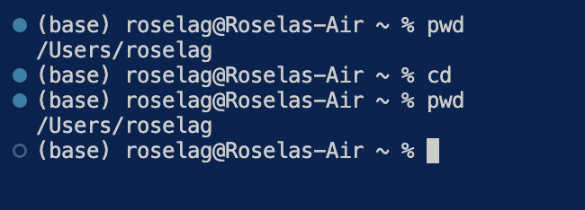
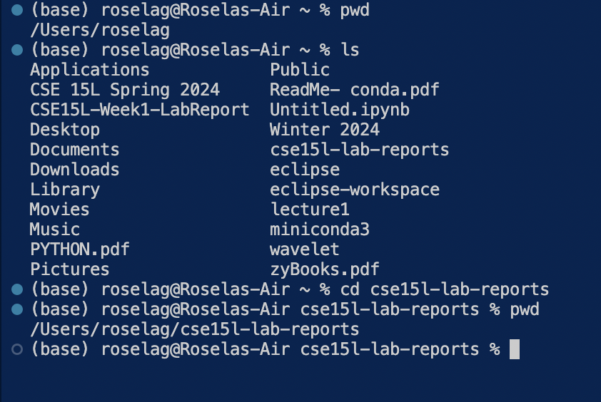
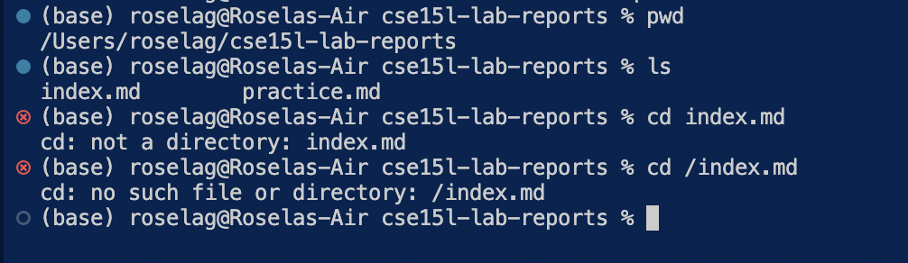
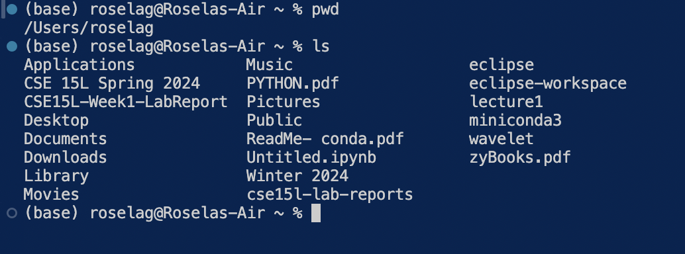
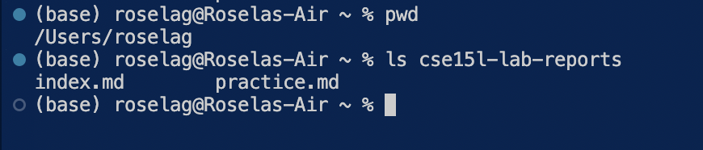
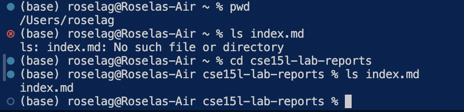
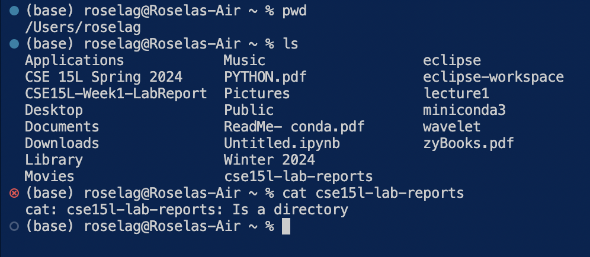
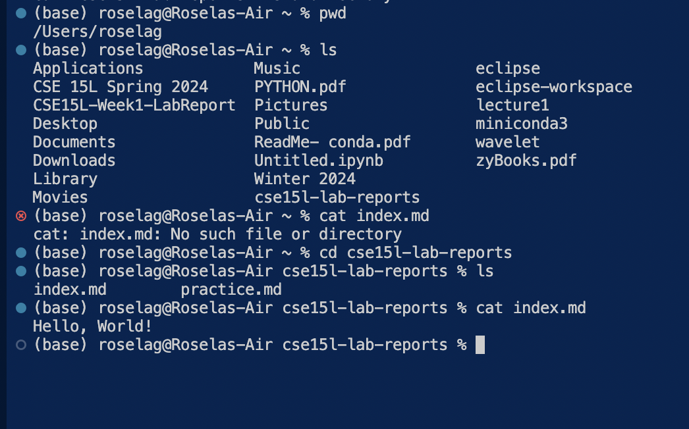

# Lab Report 1 - Remote Access and FileSystem (Week 1)

## cd

**Share an example of using the command with no arguments.**
  
My current working directory before the `cd` command is `/Users/roselag` (absolute path); when `cd` was called, it did not change the working directory because there is no specified directory to change into. Also we are already in the home directory; if we are in a different directory and we did `cd` with no arguments, then we would return to the home directory. This is not an error.
 
 

**Share an example of using the command with a path to a directory as an argument.**
  
My current directory before the `cd` command is `/Users/roselag` (absolute path); when `cd cse15l-lab-reports` had been called, the current working directory changed to `/Users/roselag/cse15l-lab-reports` because `cse15l-lab-reports` exists in my machine and because of the fact that`cd` is to change directory and we specified what directory to change to, it indeed changed to `/Users/roselag/cse15l-lab-reports`. This is not an error. 
 
 

**Share an example of using the command with a path to a file as an argument.**
  
The current working directory before the `cd` command is `/Users/roselag/cse15l-lab-reports` (absolute path); when `cd index.md` was called (`index.md` exists inside of the current working directory), it resulted to an error (it is indeed an error) because `cd` is meant to change directories and `index.md` is a file not a directory.
 
 

 
## ls

**Share an example of using the command with no arguments.**
  
The current working directory before `ls` command is `/Users/roselag` (absolute path); when `ls` was called, it just listed the directories and files inside of the current working directory. Since there is no specific argument given, it just listed the files and directories inside of the current working directory. This is not an error. 
 
 

**Share an example of using the command with a path to a directory as an argument.**
  
The current working directory before the `ls` command is `/Users/roselag` (absolute path); when `ls cse15l-lab-reports` was called, it listed the contents of `cse15l-lab-reports` because we specified to list the contents of `cse15l-lab-reports` and `cse15l-lab-reports` exists in the current working directory with that `ls` command with `cse15l-lab-reports`as an argument . This is not an error.
 
 

**Share an example of using the command with a path to a file as an argument.**
  
The current working directory before the `ls` command is `/Users/roselag/cse15l-lab-reports/` (absolute path); when `ls index.md` was called, it just list `index.md` as `index.md` does exists in the current working directory. This is not an error because the `ls` command will list the files and directory but it will not display the contents of `index.md`.
 
 
 
## cat

**Share an example of using the command with no arguments.**
  
The current working directory before the `cat` command is `/Users/roselag` (absolute path); when `cat` was called, the terminal appeared like it is hanging and waiting for my input. Although not pictured in the screenshot, I tried to use `exit` to get out of it, but it just prints out `exit` (If I type `yyy` it will display `yyy`). This is not an error; this is exactly what will happen if I run `cat` without no argument because `cat` displays content of files but without the specific file(s) to display, it will read from the keyboard.
 
 

**Share an example of using the command with a path to a directory as an argument.**
  
The current working directory before `cat` command is `/Users/roselag` (absolute path); when `cat cse15l-lab-reports` was called, it displays an error message because `cat` is expecting a file and `cse15l-lab-reports` is a directory not a file. This is indeed an error because `cat` is designed to concatenate and display contents of files not directories.
 
 

**Share an example of using the command with a path to a file as an argument.**
  
The current working directory before the `cat` command is `/Users/roselag/cse15l-lab-reports` (absolute path); when `cat index.md` was called, it displayed the contents of `index.md` because `index.md` is a file inside of the working directory. This is not an error because cat is designed to handle a file as an argument. 

