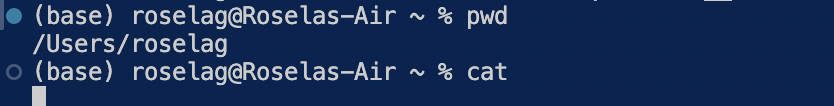

# Lab Report 1 - Remote Access and FileSystem (Week 1)

## cd

**Share an example of using the command with no arguments.**
  
**Share an example of using the command with a path to a directory as an argument.**
  
**Share an example of using the command with a path to a file as an argument.**
  

## ls

**Share an example of using the command with no arguments.**
  
**Share an example of using the command with a path to a directory as an argument.**
  
**Share an example of using the command with a path to a file as an argument.**
  

## cat

**Share an example of using the command with no arguments.**
  
**Share an example of using the command with a path to a directory as an argument.**
  
**Share an example of using the command with a path to a file as an argument.**
  
